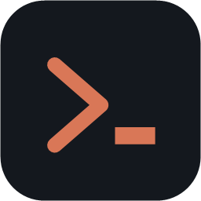
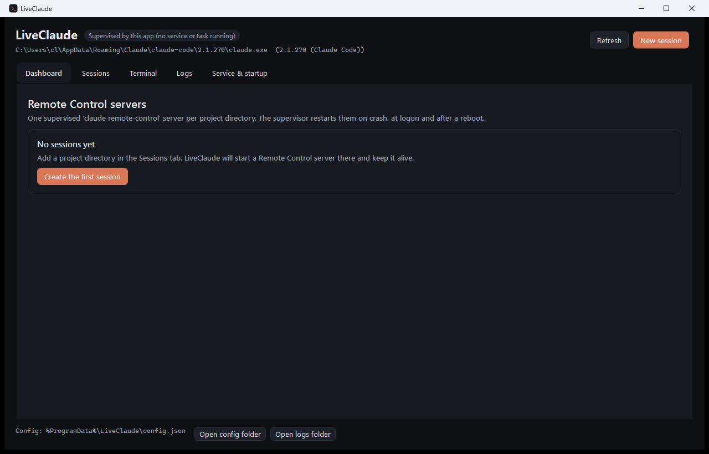
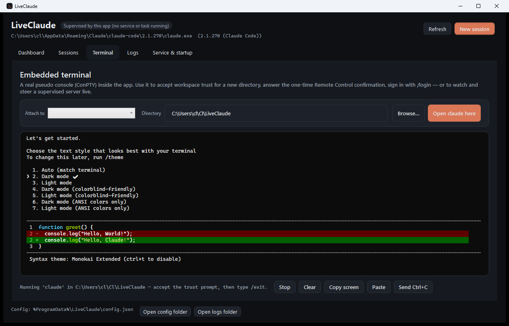

<div align="center">



# LiveClaude

**Keep Claude Code Remote Control alive on your Windows machine — many projects, one supervisor, and a desktop app to drive it all.**

[](https://github.com/LeandroCannizzaro/LiveClaude/actions/workflows/ci.yml)
[](https://github.com/LeandroCannizzaro/LiveClaude/releases)
[](LICENSE)
[](https://dotnet.microsoft.com/download)
[](https://www.microsoft.com/windows)

[Product page](https://leandrocannizzaro.github.io/LiveClaude/) · [Download](https://github.com/LeandroCannizzaro/LiveClaude/releases/latest) · [Report a bug](https://github.com/LeandroCannizzaro/LiveClaude/issues)



</div>

---

## What it does

[Claude Code Remote Control](https://code.claude.com/docs/en/remote-control) lets you drive a Claude Code session running on your own machine from claude.ai or the Claude mobile app. The catch: it is a foreground process in a terminal. Close the window, hit a crash, reboot the machine — and your phone loses the machine.

LiveClaude turns that into infrastructure:

- **One `claude remote-control` server per project directory**, each with its own spawn mode, permission mode and capacity.
- **A supervisor** that restarts a server when it dies (exponential backoff), at logon, and after a reboot — as a **Windows Scheduled Task** or a **Windows Service**, your choice.
- **A desktop app** to create, edit and remove sessions, watch their state live, read their logs, and install or remove the supervisor.
- **An embedded terminal** — a real pseudo console (ConPTY) rendered by a VT emulator written from scratch in C# — so the one-time flows that need a terminal (workspace trust, the Remote Control confirmation, `/login`) happen inside the app, and so you can attach to a running server and type into it.

Everything is C#. No Node, no Python, no tmux, no browser control.

<div align="center">

<br /><em>Claude Code's real TUI rendered inside the app's terminal tab — the trust prompt, and anything else that needs a terminal.</em>
</div>

## Install

### winget

```powershell
winget install LeandroCannizzaro.LiveClaude
```

### Zip (portable)

1. Download `LiveClaude-win-x64.zip` from the [latest release](https://github.com/LeandroCannizzaro/LiveClaude/releases/latest).
2. Unblock and extract it anywhere.
3. Run `LiveClaude.exe`.

The `-selfcontained` zip has no prerequisites. The plain zip needs the [.NET 10 Desktop Runtime](https://dotnet.microsoft.com/download/dotnet/10.0).

### ClickOnce (auto-updating)

Open [LiveClaude.application](https://leandrocannizzaro.github.io/LiveClaude/clickonce/LiveClaude.application) — it installs for the current user and checks for updates on every launch. The manifests are unsigned, so SmartScreen asks once.

### From source

```powershell
git clone https://github.com/LeandroCannizzaro/LiveClaude.git
cd LiveClaude
dotnet build -c Release
dotnet run --project src\LiveClaude.App
```

## Requirements

| | |
|---|---|
| OS | Windows 10 1809+ or Windows 11 (ConPTY) |
| Runtime | .NET 10 Desktop Runtime (bundled in the self-contained zip) |
| Claude Code | Signed in with a Pro, Max, Team or Enterprise account. API keys, Bedrock, Vertex and Foundry are not supported by Remote Control |
| CLI | A native install is recommended (`claude install stable`) — the copy bundled with the Claude desktop app lives in a versioned folder whose path changes on every update |

## Quick start

1. **Open LiveClaude** → *Sessions* → **New session**.
2. Pick the project directory, give it a name, choose spawn and permission mode. The **command preview** shows exactly what will run.
3. Click **Trust this directory…** — the embedded terminal opens and runs `claude` there so you can accept the one-time workspace-trust prompt, then type `/exit`.
4. Click **Run remote-control once…** the first time, to accept `Enable Remote Control? (y/n)`.
5. **Save session**, then go to *Service & startup* → **Install / update task**.

The server now shows up at [claude.ai/code](https://claude.ai/code) and in the Claude mobile app, and comes back on its own after a crash, a logout or a reboot.

## Hosting: task or service

| | Scheduled task *(recommended)* | Windows service |
|---|---|---|
| Runs as | your signed-in user | the account you choose (use your own) |
| Starts | at logon and 30 s after boot | at boot, before sign-in |
| Restarts | every minute on failure, no time limit, keeps running on battery | `sc.exe` failure actions: 5 s, 10 s, then every 30 s |
| Elevation | not required | required to install |
| Claude credentials | always found | only if the service runs as your user — LocalSystem has a different profile and cannot sign in |

Both are installed from the app, or from the CLI:

```powershell
LiveClaude.Service.exe install-task
LiveClaude.Service.exe install-service --account "DOMAIN\you" --password "<windows password>"
LiveClaude.Service.exe status
```

The app talks to whichever supervisor is running over a named pipe (`LiveClaude.v1`), so you can close the window and the servers keep running — and reopen it later to find them.

## Dead entries in the session picker

Every `claude remote-control` process registers a **bridge environment** on Anthropic's side, and the
registration outlives the process. Stop a server and start it again and you get a second entry for the
same directory; do it three times and the picker in Claude Desktop shows the project three times, one
live and the rest dead. Archiving conversations does not touch them — they are environments, not
sessions ([claude-code#50884](https://github.com/anthropics/claude-code/issues/50884)).

LiveClaude handles both ends of that:

- **It stops servers the way a person would.** Stopping sends Ctrl+C and waits (12 s by default, in
  *Service & startup*) before terminating, so the CLI gets its chance to deregister. The previous
  behaviour — a hard kill — is exactly what creates the dead entries.
- **It knows which environment is which.** When a server comes up, LiveClaude asks the API which
  bridge environment it just registered and remembers it, so a live entry can never be mistaken for a
  leftover. Turn this off with *Track which environment each server registers* to stay fully offline.
- **The Environments tab cleans up the rest.** It lists the bridge environments on your account
  grouped by directory, marks each one live / stale / untracked, and deletes the ones you pick:
  - **Select duplicates** keeps the live one — or the newest — for each directory and selects the
    others. This is the answer to "three `doG`, one alive".
  - **Select stale** picks the environments whose directory LiveClaude supervises but which have no
    server behind them.
  - An environment in use is never selectable, and deletion always asks first. Protection does not
    depend on the API lookup succeeding: **a directory with a running server protects every
    registration made during that run**, including one the server creates again after a delete. Stop
    the session in the Dashboard to clear those. Leftovers from earlier runs of the same directory
    stay deletable while the server runs.

### When a delete is refused

The API answers `409 Conflict` when an environment still has session records attached:

```
Environment has 1 active sessions. Use force=true to delete anyway.
```

Those sessions are themselves leftovers of servers that were killed rather than stopped. LiveClaude
shows the reason on the row and in a panel above the list — with Anthropic's `request-id` — and offers
a **Force delete** button that retries with `force=true`, deleting the environment together with its
session records. Every call, successful or not, is appended to
`%ProgramData%\LiveClaude\logs\environments.log`; *Open log* in the toolbar goes straight there.

Not every entry in the picker is a bridge environment: the ones Claude Code on the web creates are
`anthropic_cloud` environments and are perfectly alive. Tick *Show non-bridge environments* to see
them.

The tab uses your own Claude Code sign-in (`~/.claude/.credentials.json`) against
`api.anthropic.com/v1/environments` with the `environments-2025-11-01` beta header. That API is in
beta and undocumented: if Anthropic changes it, the tab reports the error and the rest of LiveClaude
keeps working.

To keep the count down without any cleanup, restart a server within Remote Control's four-hour window
so `--continue` reattaches instead of registering a fresh environment.

## Session parameters

Each session maps one-to-one onto `claude remote-control` flags:

| Field | Flag | Notes |
|---|---|---|
| Name | `--name` | Title shown at claude.ai/code |
| Directory | working directory | Must be trusted once by Claude Code |
| Spawn mode | `--spawn same-dir\|worktree\|session` | `worktree` gives each remote session its own git worktree |
| Permission mode | `--permission-mode` | `acceptEdits` or `auto` keep things moving with nobody at the keyboard |
| Capacity | `--capacity` | Up to 32 concurrent sessions; ignored for `session` |
| Pre-create session | `--[no-]create-session-in-dir` | Off means the server archives its sessions on exit |
| Session name prefix | `--remote-control-session-name-prefix` | Defaults to the hostname |
| Reattach after restart | `--continue` | Applied automatically when the previous server stopped less than **4 hours** ago |
| Fixed session id | `--session-id` | Wins over every spawn flag |
| Sandbox / Verbose | `--sandbox` / `--verbose` | |
| Extra arguments | appended verbatim | For anything not modelled above |

**About the 4-hour window:** `claude remote-control --continue` can only bring back the sessions a stopped server was serving for about four hours. LiveClaude records the stop time per instance and reattaches when it still can; past that it starts a fresh session. The conversations themselves are never lost — they stay resumable locally with `claude --resume`.

## How it works

```
                        ┌─────────────────────────────┐
  claude.ai / mobile ───┤  Anthropic Remote Control   │
                        └──────────────┬──────────────┘
                                       │ outbound HTTPS only
┌──────────────────────────────────────┼───────────────────────────────┐
│ your machine                         │                               │
│                                      ▼                               │
│   ┌──────────────┐  named pipe   ┌────────────────────────────────┐  │
│   │ LiveClaude   │◄─────────────►│ LiveClaude.Service             │  │
│   │ desktop app  │  status,      │ (scheduled task or service)    │  │
│   │              │  terminal I/O │                                │  │
│   │  Dashboard   │               │  Supervisor                    │  │
│   │  Sessions    │               │   ├── instance "LivePlatform"  │  │
│   │  Terminal ───┼───────────────┼──►│   └── ConPTY ─ claude.exe  │  │
│   │  Logs        │               │   ├── instance "beELive"       │  │
│   │  Settings    │               │   │   └── ConPTY ─ claude.exe  │  │
│   └──────────────┘               │   └── backoff, logs, state     │  │
│                                  └────────────────────────────────┘  │
└──────────────────────────────────────────────────────────────────────┘
```

| Project | What it is |
|---|---|
| `src/LiveClaude.Core` | Config store, CLI locator, argument builder, ConPTY host, supervision engine, named-pipe IPC, service/task installers |
| `src/LiveClaude.Terminal` | VT/ANSI emulator and the WPF terminal control (screen buffer, 256-colour and true-colour SGR, alternate buffer, key translation) |
| `src/LiveClaude.Service` | Windowless supervisor host: Windows service, scheduled task, and the install/uninstall/status CLI |
| `src/LiveClaude.App` | WPF desktop app (dashboard, session editor, embedded terminal, logs, hosting) |
| `tests/LiveClaude.Tests` | Unit tests for the argument builder, backoff, output classification, config store, VT parser and the ConPTY pipeline |

### One Windows detail worth knowing

A process that owns a console hands **its** console to every child it starts, and Windows then ignores the pseudo-console attribute — the child's output never reaches your pipes. That is why the supervisor and the app are both windowless executables, and why the supervisor only borrows the caller's console for one-shot CLI commands. If you ever host the supervisor yourself from a console process, the dashboard will tell you: *"this process owns a console…"*.

## Where things live

| | |
|---|---|
| Configuration | `%ProgramData%\LiveClaude\config.json` |
| Instance logs | `%ProgramData%\LiveClaude\logs\<name>-<id>.log` |
| Supervisor log | `%ProgramData%\LiveClaude\logs\supervisor.log` |
| Reattach state | `%ProgramData%\LiveClaude\state\<id>.json` |
| App errors | `%LOCALAPPDATA%\LiveClaude\app-errors.log` |

## Troubleshooting

**"Needs attention" on a session.** Claude Code is waiting for a human: workspace trust, the Remote Control confirmation, or a sign-in. Open the *Terminal* tab, attach to the instance and answer it — you are typing straight into the running server.

**The server exits immediately.** Read the instance log. The usual causes are an untrusted directory, a missing sign-in (`claude /login` in the embedded terminal, or `claude setup-token`), `ANTHROPIC_BASE_URL` pointing somewhere other than `api.anthropic.com`, or `DISABLE_TELEMETRY` / `DO_NOT_TRACK` switched on — Remote Control needs the feature-flag check those disable.

**The service is installed but nothing starts.** It is almost certainly running as LocalSystem. Reinstall it with `--account "DOMAIN\you"` so it uses your profile, where the Claude credentials live.

**The machine sleeps and the sessions go offline.** Remote Control needs the machine awake. Disable sleep, or enable *Wake the computer to run this task* on the scheduled task.

## Development

```powershell
dotnet build                 # build everything
dotnet test                  # 38 tests, no network needed
dotnet run --project src\LiveClaude.App
dotnet run --project src\LiveClaude.Service -- status
```

`LiveClaude.exe --terminal <directory>` opens the app straight into the embedded terminal for that folder — the fastest route to a trust prompt.

## Contributing

Issues and pull requests are welcome. Keep the C#-only rule: no Node, no web views, no native dependencies beyond Win32.

## License

[MIT](LICENSE) © Leandro Cannizzaro

LiveClaude is an independent project. It is not affiliated with, endorsed by, or sponsored by Anthropic.
